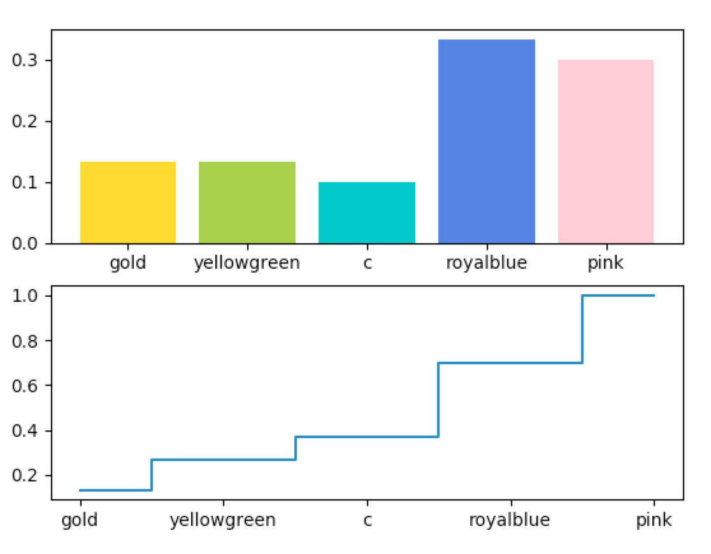

# Statistics Projects
Statistics Projects.

## Setup
**Assume Python 3 and virtualenv installed**.

```sh
virtualenv -p python3 .
source bin/activate
```

# Experiments


## pmf-and-cdf

```sh
python pmf-and-cdf/main.py
```



Output:
```
# pmf
[ 0.13333333  0.13333333  0.1         0.33333333  0.3       ]
# cdf
[ 0.13333333  0.26666667  0.36666667  0.7         1.        ]
```

## value-iteration
Apply value iteration on a classic grid world.

* noise: `0.2`.
* discount factor: `0.9`.
* end states: `+1` and `-9`.

Iteration: `1`:
```sh
python value-iteration/main.py 1
```

Output:
```
   0.0↓    0.0←   0.72→     1.0
   0.0↑     0.0    0.0↑    -9.0
   0.0↑    0.0←    0.0←    0.0←
```

Iteration: `1000`:
```sh
python value-iteration/main.py 1000
```

Output:
```
 0.403→  0.523→  0.727→     1.0
  0.29↑     0.0  0.076↑    -9.0
 0.223↑  0.161←  0.123←  0.011←
```
