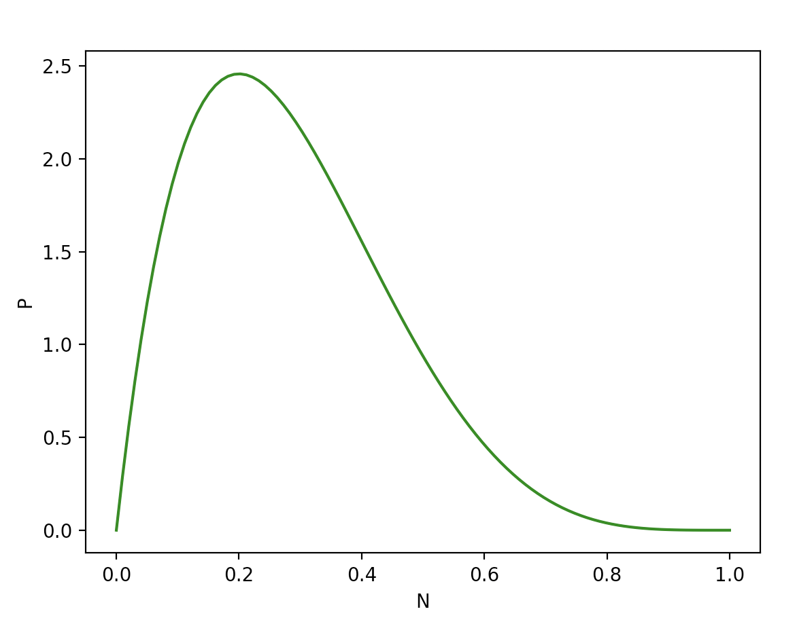

# Beta Distribution - PDF Plot
PDF plot of a beta distribution.

Example:
* `a`: the `α` param of beta distribution
* `b`: the `β` param of beta distribution
```sh
python main.py 2 5
```

Output:


