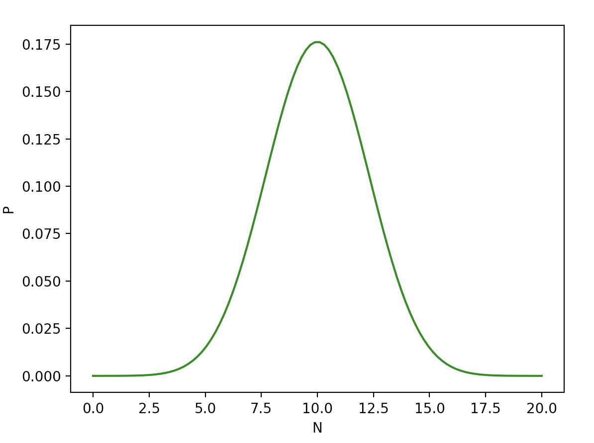

# Biased Binomial Distribution - PMF Plot
PMF plot of a biased binomial distribution.

Example:
* `p` 0.5 (probability of success)
* `n` 20 (number of trials)
```sh
python main.py 0.5 20
```

Output:


